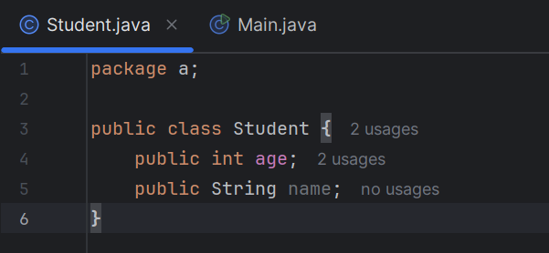
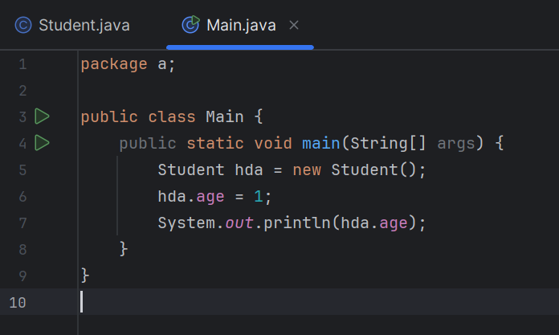

# BUỔI 1: WELCOME TO JAVA

## 1. Tổng quan về ngôn ngữ java 
### a. Ngôn ngữ Java là gì?
- Java là một ngôn ngữ bậc cao, tiết kiệm bộ nhớ và là một ngôn ngữ hướng đối tượng
### b. Lý do ra đời của Java 
- Do nhu cầu về một ngôn ngữ đa nền tảng ("Viết một lần, chạy mọi nơi"), tức là mã Java đã biên dịch có thể chạy trên tất cả các nền tảng hỗ trợ Java mà không cần biên dịch lại
### c. Cách java hoạt động
- Khi chúng ta viết lệnh trên IDE của Java thì trình biên dịch của Java sẽ biên dịch mã trên thành dạng bytecode (mã trung gian) sau đó mã này sẽ được thực thi bởi máy ảo hoặc trình thông dịch để chuyển đổi thành mã máy có thể hiểu và chạy được
## 2. Cấu trúc chương trình Java
### a. Cấu trúc tổng quát
``` java
// Chương trình thuộc package nào (chỉ thuộc 1 package)
package package_name;

// Import class vào để sử dụng (có thể import nhiều class)
import java.util.Scanner;  // Import một class
import java.util.*;  // Import toàn bộ package

// Định nghĩa thêm các class khác
class Util {
    ...
}

// Class chính, là public class duy nhất trong file
public class App {
    ...
    // Class chính phải có method main() như sau
    public static void main(String[] args) {
        ...
    }
}
```
### b. Package
- Package là nhóm các class, interface, enum… dùng để tổ chức mã nguồn và kiểm soát phạm vi truy cập.
- Cách khai báo:
``` java
import (Tên Package).(Tên class); // Import 1 class trong package đó
import (Tên Package).*; //Import tất cả
```
### c. Syntax: 
| Kiểu    | Mô tả                                     | Mặc định | Cỡ      | Ví dụ                                                     |
| ------- | ----------------------------------------- | -------- | ------- | --------------------------------------------------------- |
| boolean | true hoặc false                           | false    | 1 bit   | `true`, `false`                                           |
| byte    | Số nguyên từ -128 .. 127                  | 0        | 8 bits  | `123`                                                     |
| char    | Ký tự Unicode                             | `\u0000` | 16 bits | `'a'`, `'\u0041'`, `'\101'`, `'\\'`, `' '`, `'\n'`, `'ß'` |
| short   | Số nguyên giá trị từ -32768 .. 32767      | 0        | 16 bits | `1000`                                                    |
| int     | Số nguyên -2,147,483,648 .. 2,147,483,647 | 0        | 32 bits | `-2`, `-1`, `0`, `1`, `2`                                 |
| long    | Số nguyên dài                             | 0        | 64 bits | `-2L`, `-1L`, `0L`, `1L`, `2L`                            |
| float   | Số thực                                   | 0.0      | 32 bits | `1.23e100f`, `-1.23e-100f`, `.3f`, `3.14F`                |
| double  | Số thực                                   | 0.0      | 64 bits | `1.23456e300d`, `-1.23456e-300d`, `1e1d`                  |
### d. Vòng lặp

* **Cách khai báo:**
  * **While:**

    ```java
    while (điều_kiện) {
        // Các câu lệnh cần lặp lại
    }
    ```

  * **For:**

    ```java
    for (khởi_tạo; điều_kiện; cập_nhật) {
        // Khối lệnh được lặp
    }
    ```

  * **Do-while:**

    ```java
    do {
        // Khối lệnh cần lặp
    } while (điều_kiện);
    ```
### e. Cấu trúc rẽ nhánh

* **Cách khai báo:**
  * **If - else:**

    ```java
    if (condition1) {
    // khối lệnh này được thực thi nếu condition1 = true
    } else if (condition2) {
    // khối lệnh này được thực thi nếu condition1 = false và condition2 = true
    } else {
    // khối lệnh này được thực thi nếu nếu tất cả những điều kiện trên = false
    }
    ```
 
### f. Mảng
- Mảng bắt buộc phải nằm trong một class nhất định hoặc nếu trong hàm main thì có thể gọi trực tiếp
```java
class Utils {
    static void myMethod() {
        System.out.println("Hello");
    }
}

public class Main {
    public static void main(String[] args) {
        Utils.myMethod(); // gọi thông qua class
    }
}
```
### g. Class và Object
#### g1. Object (Đối tượng)
- Đối tượng trong java là một thực thể được tạo ra từ class bằng new (và mỗi đối tượng sẽ có những đặc tính riêng)
- Các object trong java cũng có những đặc trưng như trạng thái, hành vi, định danh
#### g2. Claas 
- Class trong java có thể được như một mẫu thiết kế, khi 
#### g3. Cách khai báo


### h. Constructor 
- Contrusctor trong Java là một mảng đặc biệt. Và sẽ được gọi khi một object của một class được tạo ra. Và có thể sử dụng để thêm giá trị ban đầu
- Constructor phải có tên cùng tên với class và không có giá trị trả về (return)
- Cách khai báo:
``` java
// Create a Main class
public class Main {
  int x;

  // Tạo contructor của class
  public Main() {
    x = 5;  // Thêm giá trị ban đầu cho x
  }

  public static void main(String[] args) {
    Main myObj = new Main(); // Tạo object của class và đồng thời cũng sẽ gọi luôn constrcutor
    System.out.println(myObj.x); // x sẽ được in ra là 5
  }
}
```

### j. Acess Modifier
|                                | default | private | protected | public |
|--------------------------------|:-------:|:-------:|:---------:|:------:|
| cùng class                     | ✅      | ✅      | ✅        | ✅     |
| cùng package subclass          | ✅      | ❌      | ✅        | ✅     |
| cùng package khác subclass      | ✅      | ❌      | ✅        | ✅     |
| khác package subclass     | ❌      | ❌      | ✅        | ✅     |
| khác package khác subclass | ❌      | ❌      | ❌        | ✅     |


### h. Getter, Setter
- Là phương pháp dùng để có thể gọi/sửa được giá trị của một biến private
- Cách khai báo:
``` java
package a;
class Student {
    private String name;
    //Getter
    public String Getname () {
        return name;
    }
    //Setter
    public void Setname (String name) {
        this.name = name;
    }
}
public class Main {
    public static void main(String[] args) {
        Student s1 = new Student();
        s1.Setname("hda");
        System.out.println(s1.Getname());
    }
}
```
### j. Static
- Static đứng trước 1 biến hay một hàm có thể giúp cho biến / hàm đó có thể được dùng mà không cần tạo object của một class
``` java
package a;
public class Main {
    static int x = 4;
    int y = 5;

    public static void main(String[ ] args) {
        System.out.println(x); // Có thể gọi luôn
        System.out.println(y); // Báo lỗi chỉ được gọi khi tạo object từ class main
    }
}
```